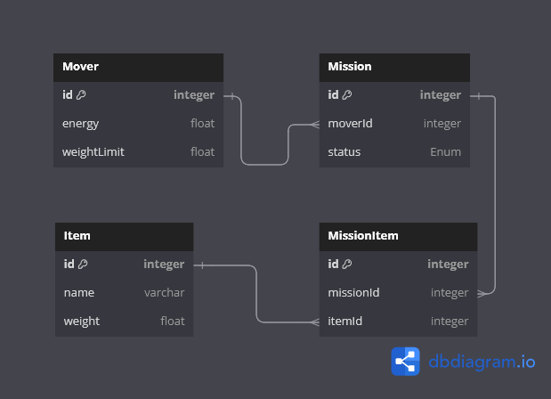

# Magic Transporters Backend Task | Unifi Solutions

## Overview

This task involves developing a REST API for Magic Transporters.
I have tried to imagine as much scenarios and test cases as i can ^\_^

## Swagger Documentation

Explore the API endpoints and their functionalities through Swagger documentation, facilitating ease of understanding and integration.

## Entity-Relationship Diagram (ERD)

Understand the database structure and relationships by referring to the provided Entity-Relationship Diagram (ERD).

## Project Structure

### `src`

Contains the source code.

#### `core`

Contains the core application code.

- `configs`: Environment variables setup.
- `exception-filters`: Prisma and HTTP exception filters.
- `exceptions`: Custom exceptions for Zod validation.
- `interceptors`: Response mapping and timeout interceptors.
- `pipes`: Zod validation pipe.
- `index.ts`: File to export all from one file for better organization.

#### `generated`

Contains auto-generated Prisma schemas thanks to a custom package.

### `modules`

Contains each module in our task.

- `env`: Setting up the environment service.
- `item`: The thing that is moved by a mover.
- `mission`: Each operation done by a mover affecting items.
- `mover`: The entity that is moving items.

Each module will have the following structure:

- `dto`: Contains all request bodies needed in controllers or services.
- `entity`: Contains the entity itself (schema and class).
- `response`: Contains the returned and Swagger-related classes for providing detailed request information dynamically.

### `shared`

Contains files that are needed throughout the coding process.

- `configs`: Separated configs for a simple-looking `main.ts` and `app.module.ts` files.
- `enums`: Enums needed in the project (e.g., `NODE_ENV`).
- `interfaces`: Useful interfaces.
- `utils`: Functions that may be used in the project.

## Getting Started

1. Clone the repository provided for the task.
2. Install dependencies using `npm install`.
3. add your .env file.
4. Run the development server using `npm run start:dev`.
5. Refer to the Swagger documentation to explore available endpoints. `https://localhost:5000/docs`
   Make sure to authenticate in order to access Swagger (as it is a sensitive page) Username: admin Password: admin.

## Author

- Mohammad Abdalrazzak

## License

This project is licensed under the MIT License.
